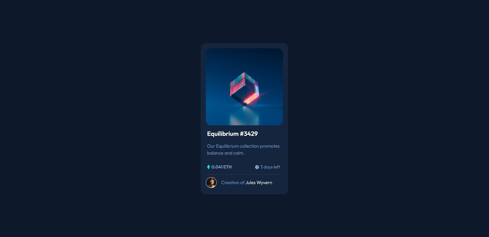
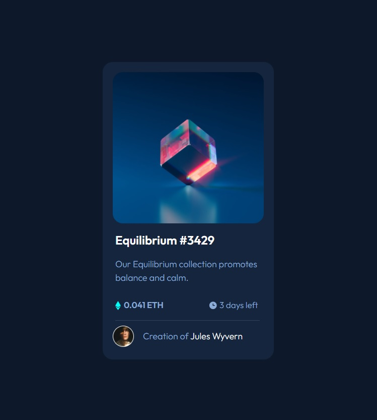

- Overview:
  - [NFT-Preview]
  - [https://wella4life.github.io/Challenge_4_Easy/]
  - 
  - 

 - Users should be able to:
   - View the optimal layout for the site depending on their device's screen size
   - Hover Stats on: "img" :Equilibrium #3429" "Julian Wyvern"

 - What I Learned:
   - I can use :after and :before to:
   - add them together
   - add them on top of one another
   - add both to an existimg img to mask it
   - Center page using 100vh height on body
 
 - What I Couldn't Do:
   - Fix less than 425px Mobiles to center content
   - Fix less than 425px Mobiles to Enlargen content
